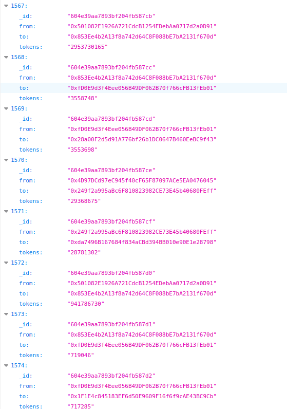

# 
 Blockchain Indexer 📇 in Golang

  

## 
 ERC20 event Indexer on Matic

This project has been built 🔨 for getting hands dirty on Golang.
For an interesting idea, stay tuned for my next hackathon 👀 so please don't bully 🥺 this one with the expectations of likes of [The Graph](https://thegraph.com/)
## Setup 🏭

- Clone this repo
- Install the dependencies `go get -u ./...`
- Setup database URI in `connectionhelper/connector.go`
- Setup ERC20 contract to be indexed in `main.go`. By default it will Index [USDC ERC20](https://explorer-mainnet.maticvigil.com/tokens/0x2791Bca1f2de4661ED88A30C99A7a9449Aa84174/token-transfers) on Matic Mainnet
- For peeking database access results on `http://localhost:12345/peekIndexedDB` after which it would look like

## Tech Stack 🧱

- Golang
- Solidity
- Go Web3
- MongoDB
